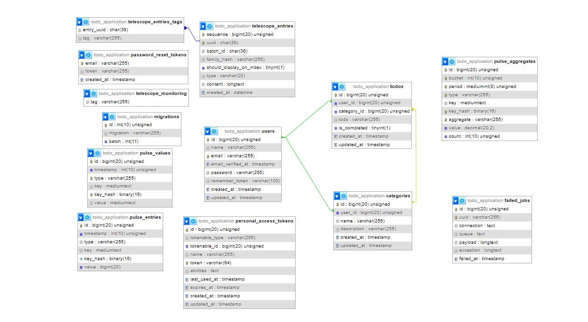
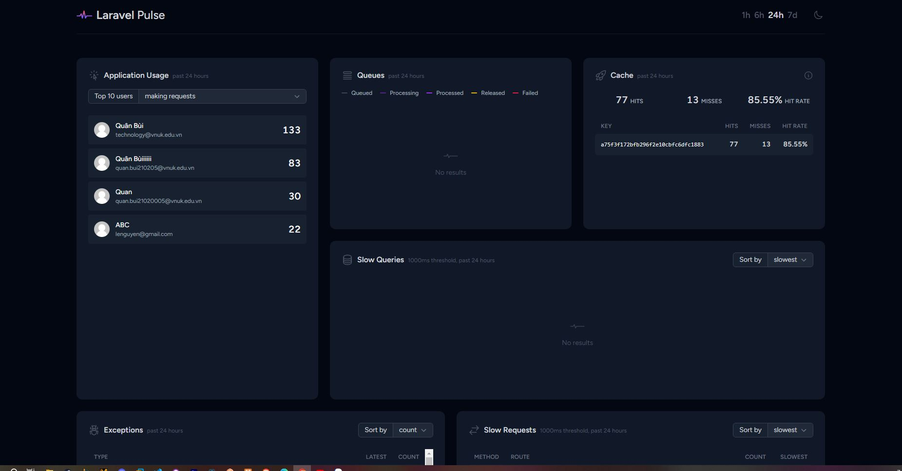

<p align="center"><a href="https://laravel.com" target="_blank"></a></p>

# A simple TODO list app built with Laravel Livewire.

## DEMO

<video src="Laravel%20-%20Google%20Chrome%202023-12-26%2006-46-13.mp4" controls title="Title"></video>

## Tech

Technologies used in this project:

- [Laravel](https://github.com/laravel/laravel) - The Laravel PHP framework.
- [Livewire](https://github.com/livewire/livewire) - Laravel Livewire.
- [Tailwind CSS](https://github.com/tailwindlabs/tailwindcss) - Tailwind.

## Database Structure

<p align="center">



</p>

## Tạo API Document với Scramble

Scramble là trình tạo tài liệu OpenAPI (Swagger) cho Laravel. Nó tự động tạo tài liệu API cho dự án của bạn mà không yêu cầu bạn phải viết chú thích PHPDoc theo cách thủ công.

<p align="center">

<video src="Laravel%20-%20API%20Docs%20-%20Google%20Chrome%202023-12-26%2007-00-20.mp4" controls title="Title"></video>

</p>

## List features of projects and screenshots

#### Telescope

Laravel Telescope makes a wonderful companion to your local Laravel development environment. Telescope provides insight into the requests coming into your application, exceptions, log entries, database queries, queued jobs, mail, notifications, cache operations, scheduled tasks, variable dumps, and more.

<p align="center">
  
  <video src="Requests%20-%20Telescope%20-%20Google%20Chrome%202023-12-26%2007-04-01.mp4" controls title="Title"></video>

</p>

#### Laravel Pulse

Laravel Pulse delivers at-a-glance insights into your application's performance and usage. With Pulse, you can track down bottlenecks like slow jobs and endpoints, find your most active users, and more.

<p align="center">

 
 
</p>

#### Task Creation

##### Login and Register:

<p align="center"

  <video src="Laravel%20-%20Google%20Chrome%202023-12-26%2007-08-07.mp4" controls title="Title"></video>

</p>

##### Users can add tasks:

<p align="center">
  <video src="Laravel%20-%20Google%20Chrome%202023-12-26%2007-10-00.mp4" controls title="Title"></video>
</p>

##### Edit:

<p align="center">
  <video src="Laravel%20-%20Google%20Chrome%202023-12-26%2007-10-58.mp4" controls title="Title"></video>
</p>

##### Search & Delete:

<p align="center">
  <video src="Laravel%20-%20Google%20Chrome%202023-12-26%2007-11-36.mp4" controls title="Title"></video>
</p>

## How to run the application

Install the dependencies and devDependencies:

```sh
$ cd TODOapp
$ composer install
```

Create your .env file and generate the application key:

```sh
$ cp .env.example .env
$ php artisan key:generate
```

Run migrations and start the server:

```sh
$ php artisan migrate
$ php artisan serve
```


